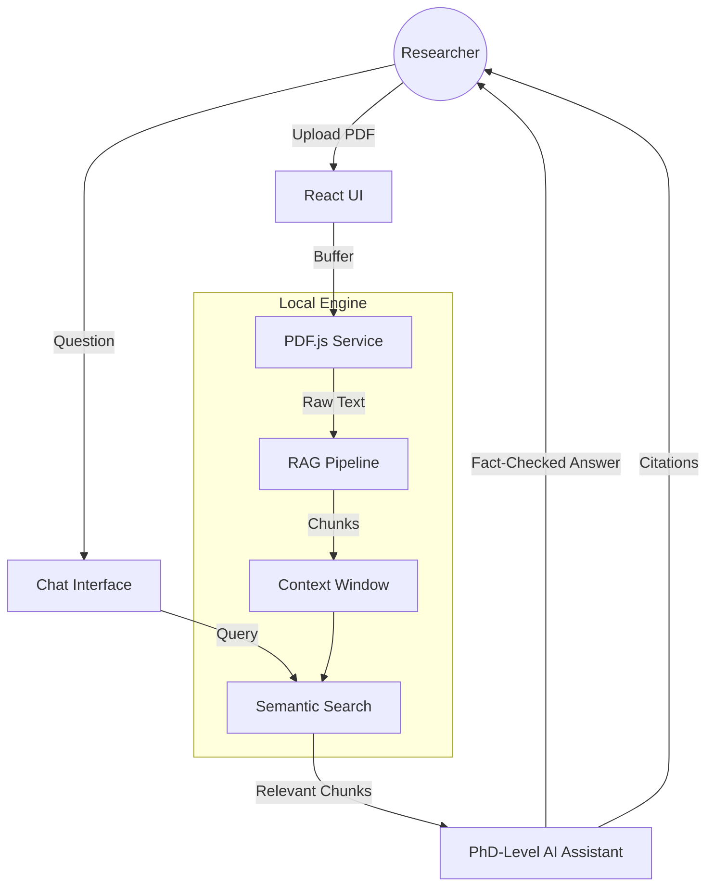

# ScholarAI System Architecture

## Data Flow
1. **PDF Parsing**: Client-side extraction ensures data privacy.
2. **Contextualization**: Text is segmented by headers (Abstract, Intro, etc.).
3. **Retrieval**: Questions trigger a search through the active context.
4. **PhD Synthesis**: The AI synthesizes the answer using the "Research Assistant" persona.
